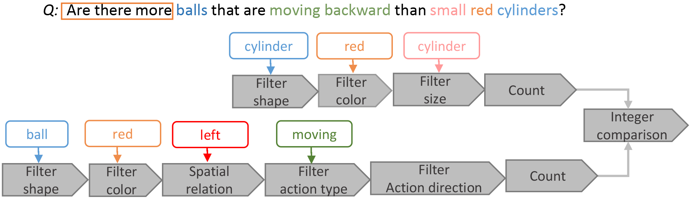

# SVQA2：A Benchmark for spatial-temporal reasoning of video question answering 

# SVQAv1 

## Introduction

Video question answering (VideoQA) always involves visual reasoning. When answering questions composing of multiple logic correlations, models need to perform **multi-step reasoning**. [SVQAv1]() (Synthetic Video Question Answering) formulate multi-step reasoning in VideoQA as a new task to answer compositional and logical structured questions based on video content. Compared with other VideoQA datasets, SVQA contains exclusively long and structured questions with various spatial and temporal relations between objects. More importantly, questions in SVQA can be decomposed into human readable logical tree or chain layouts, each node of which represents a sub-task requiring a reasoning operation such as comparison or arithmetic. 

## Dataset

The SVQA(Synthetic Video Question Answering) dataset contains 31,690 videos and around 600k QA pairs. Videos and QA pairs are all generated automatically with minimal language biases and clearly defined question categories. The dataset can facilitate the analysis on models reasoning skills.

You can download the dataset from this [link]().

### Video and QA Pair Examples

| QA Category | Question | Answer | Video(GIF) |
| :----------------- | --------------------------------- | ----------------------------- | ---------------------------------------- |
| Attribute Comparison |  | no |  |
| Count|  | 5 |  |
| Query|  | blue |  |
| Integer Comparison |  | no |  |
| Exist|  | yes ||

## Statistics of SVQA

| Question  Category           | Sub  Category | QA_pairs1 | QA_pairs2 |
| ---------------------------- | ------------- | --------- | --------- |
| Count                        |               | 27600     |           |
| Exist                        |               | 9600      |           |
| Query & Attribute Comparison | Color         | 14232     | 99442     |
|                              | Size          | 14232     | 83619     |
|                              | Action Type   | 13032     | 83619     |
|                              | Direction     | 14232     | 95188     |
|                              | Shape         | 14232     | 97332     |
| Integer Comparison           | More          | 3840      |           |
|                              | Equal         | 3840      |           |
|                              | Less          | 3840      |           |
| Total QA pairs               |               | 118800    | 472829    |
| Total Videos                 |               | 12000     | 19690     |

# SVQAv2

## Introduction

## Dataset

## Video and QA Pair Examples

